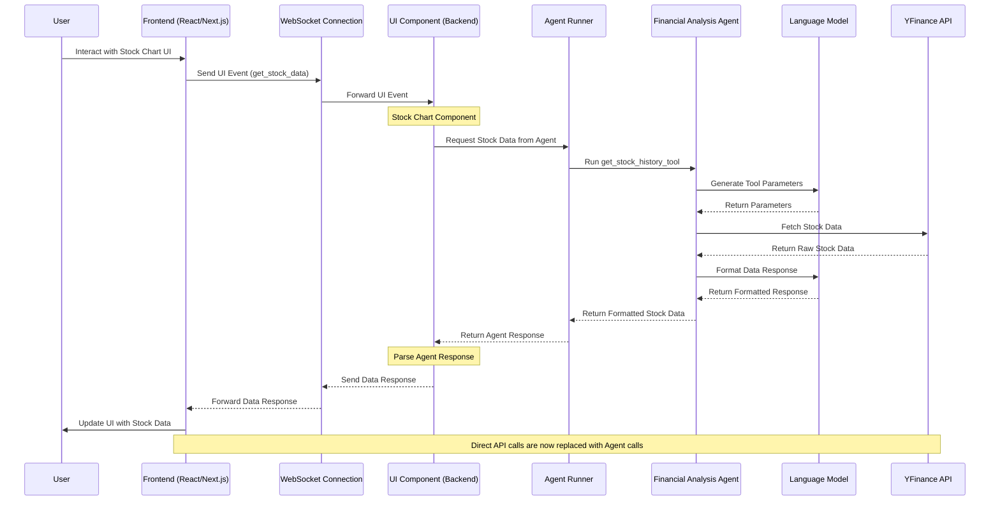
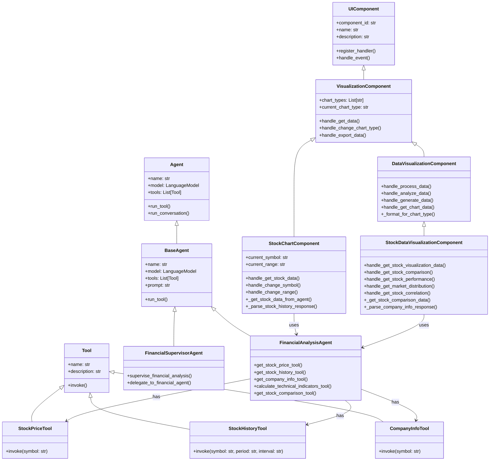
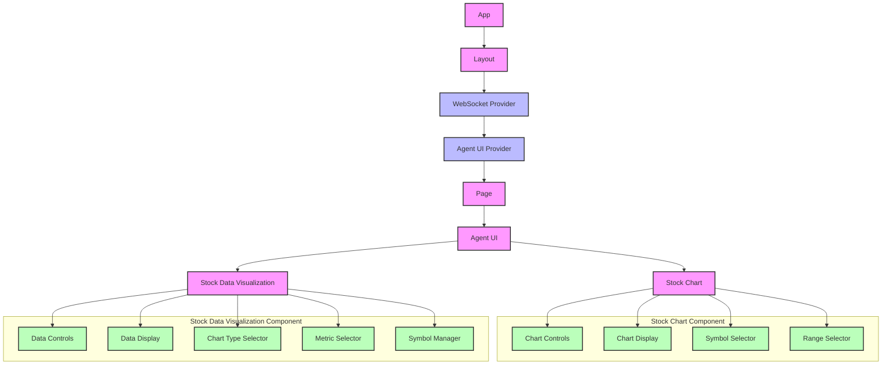
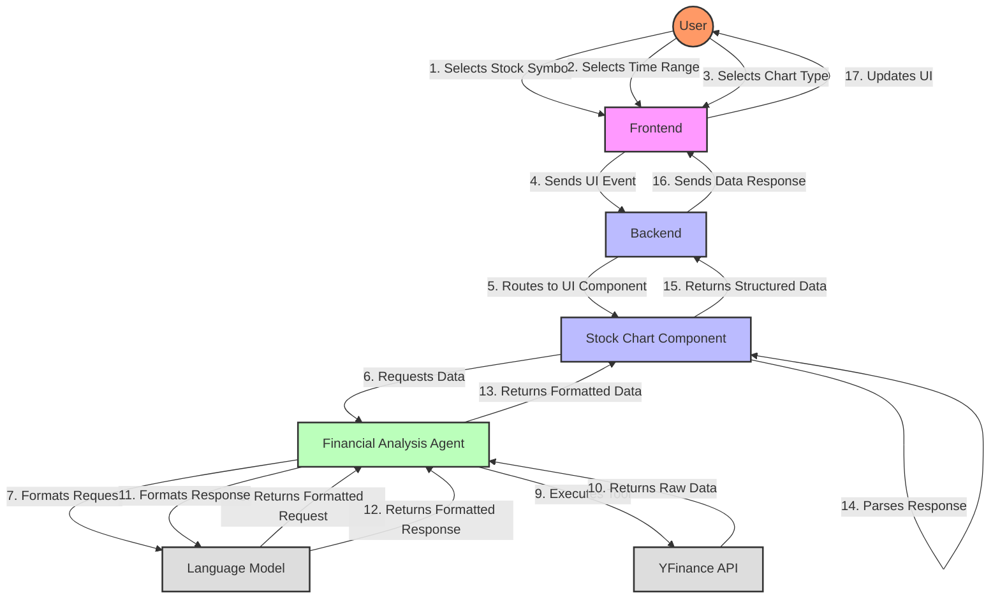

# Mosaic Framework Architecture

This document provides a comprehensive overview of the Mosaic framework architecture, using the Financial Analysis agent and UI components as an example.

## System Architecture Diagram

```mermaid
graph TB
    %% Main Components
    User((User))
    Frontend[Frontend Application]
    Backend[Backend Server]
    Database[(Database)]
    LLM[Language Model]
    
    %% Frontend Components
    subgraph "Frontend (Next.js)"
        FrontendApp[App Router]
        WebSocketClient[WebSocket Client]
        UIComponents[UI Components]
        AgentUI[Agent UI]
        
        %% Financial UI Components
        subgraph "Financial UI Components"
            StockChart[Stock Chart Component]
            StockDataViz[Stock Data Visualization]
        end
        
        %% Context Providers
        subgraph "Context Providers"
            WebSocketContext[WebSocket Context]
            AgentUIContext[Agent UI Context]
        end
    end
    
    %% Backend Components
    subgraph "Backend (FastAPI)"
        WebSocketServer[WebSocket Server]
        UIComponentRegistry[UI Component Registry]
        AgentRegistry[Agent Registry]
        AgentRunner[Agent Runner]
        
        %% UI Components
        subgraph "UI Components"
            StockChartComponent[Stock Chart Component]
            StockDataVizComponent[Stock Data Visualization Component]
            DataVisualizationComponent[Data Visualization Component]
            VisualizationComponent[Visualization Component]
        end
        
        %% Agents
        subgraph "Agents"
            FinancialAnalysisAgent[Financial Analysis Agent]
            FinancialSupervisor[Financial Supervisor]
            
            %% Agent Tools
            subgraph "Financial Tools"
                GetStockPrice[Get Stock Price Tool]
                GetStockHistory[Get Stock History Tool]
                GetCompanyInfo[Get Company Info Tool]
                CalculateTechnicalIndicators[Calculate Technical Indicators Tool]
                GetStockComparison[Get Stock Comparison Tool]
            end
        end
    end
    
    %% External Services
    YFinance[YFinance API]
    
    %% Connections
    User --> Frontend
    Frontend <--> Backend
    Backend <--> Database
    Backend <--> LLM
    
    %% Frontend Connections
    FrontendApp --> UIComponents
    FrontendApp --> AgentUI
    AgentUI --> StockChart
    AgentUI --> StockDataViz
    WebSocketClient <--> WebSocketContext
    WebSocketContext --> AgentUIContext
    AgentUIContext --> StockChart
    AgentUIContext --> StockDataViz
    
    %% Backend Connections
    WebSocketServer <--> WebSocketClient
    WebSocketServer --> UIComponentRegistry
    UIComponentRegistry --> StockChartComponent
    UIComponentRegistry --> StockDataVizComponent
    StockChartComponent --> VisualizationComponent
    StockDataVizComponent --> DataVisualizationComponent
    DataVisualizationComponent --> VisualizationComponent
    
    %% Agent Connections
    WebSocketServer --> AgentRegistry
    AgentRegistry --> AgentRunner
    AgentRunner --> FinancialAnalysisAgent
    AgentRunner --> FinancialSupervisor
    FinancialAnalysisAgent --> GetStockPrice
    FinancialAnalysisAgent --> GetStockHistory
    FinancialAnalysisAgent --> GetCompanyInfo
    FinancialAnalysisAgent --> CalculateTechnicalIndicators
    FinancialAnalysisAgent --> GetStockComparison
    
    %% Data Provider Connections
    GetStockPrice --> YFinance
    GetStockHistory --> YFinance
    GetCompanyInfo --> YFinance
    
    %% UI Component to Agent Connections
    StockChartComponent -- "Uses Agent" --> AgentRunner
    StockDataVizComponent -- "Uses Agent" --> AgentRunner
    
    classDef frontend fill:#f9f,stroke:#333,stroke-width:2px;
    classDef backend fill:#bbf,stroke:#333,stroke-width:2px;
    classDef agent fill:#bfb,stroke:#333,stroke-width:2px;
    classDef database fill:#fb5,stroke:#333,stroke-width:2px;
    classDef external fill:#ddd,stroke:#333,stroke-width:2px;
    
    class FrontendApp,WebSocketClient,UIComponents,AgentUI,StockChart,StockDataViz,WebSocketContext,AgentUIContext frontend;
    class WebSocketServer,UIComponentRegistry,AgentRegistry,AgentRunner,StockChartComponent,StockDataVizComponent,DataVisualizationComponent,VisualizationComponent backend;
    class FinancialAnalysisAgent,FinancialSupervisor,GetStockPrice,GetStockHistory,GetCompanyInfo,CalculateTechnicalIndicators,GetStockComparison agent;
    class Database database;
    class YFinance,LLM external;
```

## Data Flow Diagram

## Component Hierarchy

## Frontend Component Structure

## Agent-UI Interaction Flow

## Key Improvements in the New Architecture

1. **Agent-Driven Data Flow**: All data now flows through the Financial Analysis agent rather than directly accessing external APIs. This allows the agent to:
   - Apply its reasoning capabilities to the data
   - Format and structure the data appropriately
   - Provide additional context and insights
   - Handle errors gracefully with meaningful messages

2. **Decoupled Components**: The UI components are now decoupled from specific data providers, making them more flexible and reusable.

3. **Enhanced User Experience**: The agent can provide more context and insights about the data, improving the overall user experience.

4. **Consistent Data Format**: The agent ensures that data is consistently formatted, even when coming from different sources.

5. **Error Handling**: The agent can provide meaningful error messages and fallback options when data is unavailable.
