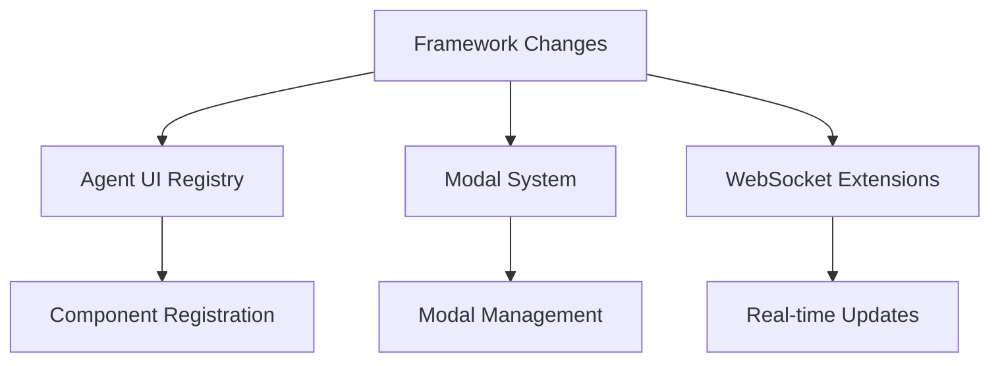
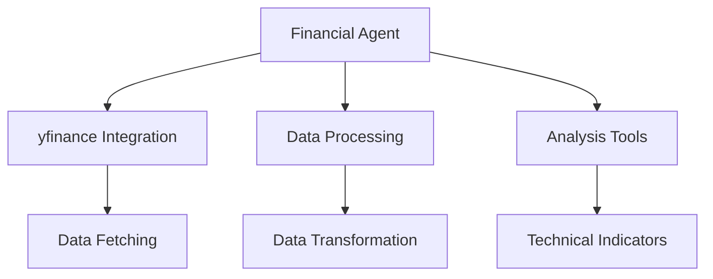
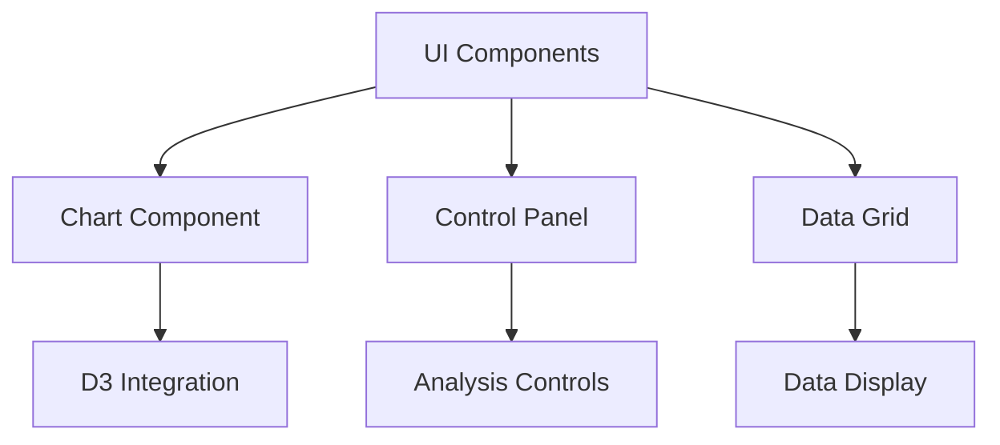
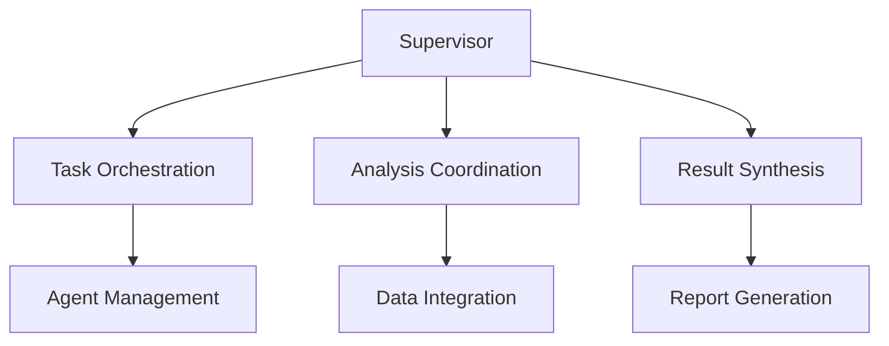
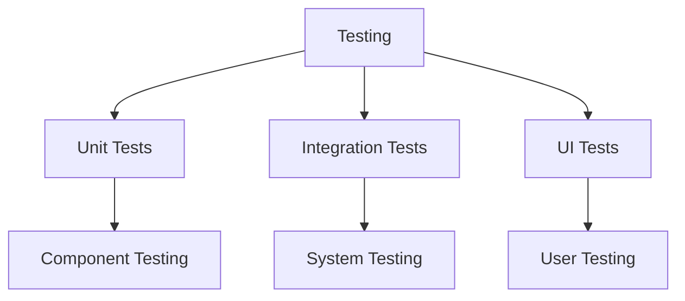

# Financial Analysis Agent with Custom UI Roadmap

This roadmap outlines the implementation plan for creating a Financial Analysis Agent with a custom UI in the MOSAIC framework. This project will serve both as a powerful financial analysis tool and as a template for future custom UI agents.

## Phase 1: Framework Enhancement for Custom UI (Week 1)



### 1.1 Custom UI Framework (2-3 days)
- [ ] Create `AgentUIComponent` interface in TypeScript
- [ ] Implement UI component registry system
- [ ] Add modal management system for full-screen agent UIs
- [ ] Extend WebSocket protocol for UI events and real-time updates
- [ ] Create UI state synchronization system

### 1.2 Base Infrastructure (2-3 days)
- [ ] Add custom UI support to `BaseAgent` class
- [ ] Create dynamic UI component loader
- [ ] Implement bidirectional state management system
- [ ] Add real-time update handlers for UI components
- [ ] Create UI event processing pipeline

## Phase 2: Financial Agent Core (Week 2)



### 2.1 Base Financial Agent (3-4 days)
- [ ] Create `FinancialAgent` class extending `BaseAgent`
- [ ] Implement yfinance integration with appropriate tools
- [ ] Add data fetching tools for stock information
- [ ] Create data processing and transformation utilities
- [ ] Implement basic financial analysis functions

### 2.2 Analysis Tools (3-4 days)
- [ ] Implement moving averages (SMA, EMA, WMA)
- [ ] Add RSI (Relative Strength Index) calculation
- [ ] Create MACD (Moving Average Convergence Divergence) analysis
- [ ] Add Bollinger Bands implementation
- [ ] Implement volume analysis tools
- [ ] Create pattern recognition utilities
- [ ] Add basic forecasting capabilities

## Phase 3: Custom UI Components (Week 3)



### 3.1 Core Components (4-5 days)
- [ ] Create base chart component with D3.js integration
- [ ] Implement time series visualization
- [ ] Add candlestick chart for OHLC data
- [ ] Create control panel component for analysis options
- [ ] Implement data grid for tabular information
- [ ] Add time range selector component
- [ ] Create company information panel

### 3.2 Interactive Features (3-4 days)
- [ ] Add zoom and pan controls for charts
- [ ] Implement indicator toggle system
- [ ] Create comparison tool for multiple stocks
- [ ] Add crosshair and tooltip functionality
- [ ] Implement data export functionality
- [ ] Create chart type switcher (line, candlestick, OHLC)
- [ ] Add annotation capabilities

## Phase 4: Financial Supervisor Agent (Week 4)



### 4.1 Supervisor Structure (3-4 days)
- [ ] Create `FinancialSupervisor` class
- [ ] Implement task orchestration system
- [ ] Add analysis coordination between sub-agents
- [ ] Create result synthesis system
- [ ] Implement prompt engineering for financial analysis
- [ ] Add error handling and recovery mechanisms

### 4.2 Integration Features (2-3 days)
- [ ] Add multi-agent coordination for complex analyses
- [ ] Implement data sharing between agents
- [ ] Create unified response format for financial data
- [ ] Add comprehensive error handling
- [ ] Implement caching for financial data
- [ ] Create rate limiting system for API calls

## Phase 5: Testing and Documentation (Week 5)



### 5.1 Testing Suite (3-4 days)
- [ ] Create unit tests for financial analysis functions
- [ ] Add integration tests for agent interactions
- [ ] Implement UI component tests
- [ ] Add end-to-end tests for complete workflows
- [ ] Create performance tests for data processing
- [ ] Implement stress tests for WebSocket communication
- [ ] Add visual regression tests for UI components

### 5.2 Documentation (2-3 days)
- [ ] Create technical documentation for financial agent
- [ ] Add usage examples and tutorials
- [ ] Create component documentation with examples
- [ ] Document extension points for customization
- [ ] Add API documentation for financial tools
- [ ] Create troubleshooting guide

## Phase 6: Framework Documentation (Week 5-6)

### 6.1 Custom UI Framework Guide (2-3 days)
- [ ] Document custom UI component creation process
- [ ] Add UI integration guide for new agents
- [ ] Create extension examples for different use cases
- [ ] Add troubleshooting guide for common issues
- [ ] Document WebSocket protocol for UI events
- [ ] Create performance optimization guide

## Technical Implementation Details

### Agent UI Component Interface
```typescript
interface AgentUIComponent {
  id: string;
  component: React.ComponentType;
  props: Record<string, any>;
  modalConfig: {
    size: 'full' | 'large' | 'medium';
    panels: string[];
    features: string[];
  };
}
```

### Agent Definition Extension
```typescript
interface AgentDefinition {
  // ... existing fields ...
  customUI?: {
    component: string;
    requiredFeatures: string[];
  };
}
```

### WebSocket Protocol Extension
```typescript
interface UIEvent {
  type: 'ui_update' | 'user_action';
  component: string;
  action: string;
  data: any;
}
```

### Financial Agent Tools
```python
class FinancialAgent(BaseAgent):
    def __init__(self):
        self.tools = [
            fetch_stock_data,
            calculate_technical_indicators,
            get_company_info,
            analyze_financials,
            compare_stocks
        ]
```

### Example Stock Data Tool
```python
@tool
def fetch_stock_data(symbol: str, period: str = "1y", interval: str = "1d") -> dict:
    """Fetch historical stock data"""
    ticker = yf.Ticker(symbol)
    history = ticker.history(period=period, interval=interval)
    return history.to_dict('records')
```

### UI Component Structure
```typescript
// TimeSeriesChart.tsx
interface TimeSeriesChartProps {
  data: TimeSeriesData[];
  options: ChartOptions;
  onRangeSelect: (range: DateRange) => void;
}

// FinancialControls.tsx
interface FinancialControlsProps {
  range: DateRange;
  indicators: string[];
  onOptionsChange: (options: AnalysisOptions) => void;
}
```

## Dependencies

### Backend
- yfinance
- pandas
- numpy
- ta (Technical Analysis library)
- scikit-learn (for basic forecasting)

### Frontend
- d3.js
- react-table
- date-fns
- recharts (as D3 wrapper)
- react-financial-charts

## Future Enhancements

### Phase 7: Advanced Features (Future)
- Portfolio analysis and optimization
- Risk assessment tools
- Sentiment analysis from news and social media
- Automated trading strategy backtesting
- Machine learning-based predictions
- Real-time market data integration
- Economic indicator analysis

## Integration with Existing Framework

This implementation will extend the current MOSAIC framework by:

1. Adding custom UI capabilities to the base agent system
2. Creating a template for future specialized agents with rich UIs
3. Enhancing the WebSocket system for real-time data visualization
4. Providing a pattern for complex data processing and visualization

The Financial Analysis Agent will serve as both a powerful tool and a reference implementation for future custom UI agents.
