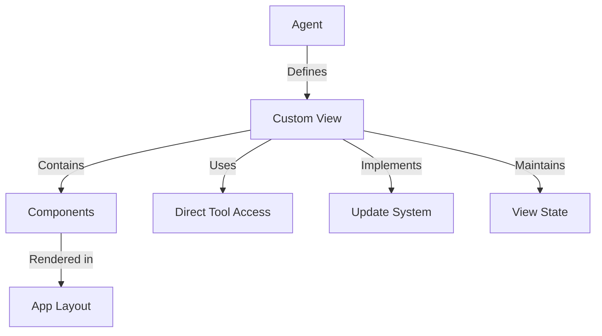

# MOSAIC Agent UI Framework Specification

## Table of Contents
1. [Overview](#overview)
2. [Core Concepts](#core-concepts)
3. [Architecture](#architecture)
4. [Component System](#component-system)
5. [Integration Points](#integration-points)
6. [State Management](#state-management)
7. [Tool Access Layer](#tool-access-layer)
8. [Real-time Updates](#real-time-updates)
9. [Type System](#type-system)
10. [Structured Output Handling](#structured-output-handling)
11. [Example Implementation](#example-implementation)
12. [Tool Invocation Best Practices](#tool-invocation-best-practices)

## Overview

The MOSAIC Agent UI Framework extends the existing agent system to support custom, full-page interactive views while maintaining the core agent architecture. This framework enables agents to provide rich, specialized interfaces beyond the standard chat interaction.

### Design Philosophy
- Agent-driven UI components
- Independent of chat interface
- Direct tool access
- Real-time updates
- Flexible layouts
- Maintainable structure

## Core Concepts



### Key Components
1. **Agent View**: Full-page interface specific to an agent
2. **Tool Access**: Direct invocation of agent tools
3. **Update System**: Real-time data flow
4. **View State**: Component-specific state management
5. **Layout System**: Flexible view organization

## Architecture

### Directory Structure
```
frontend/
  components/
    agents/
      [agent-name]/
        view/
          index.tsx         # Main view component
          components/       # View-specific components
          hooks/           # Custom hooks
          types.ts         # Type definitions
          state.ts         # State management
```

### View Registration
```typescript
interface AgentView {
  layout: 'full' | 'split' | 'dashboard';
  components: {
    main: React.ComponentType;
    sidebar?: React.ComponentType;
    toolbar?: React.ComponentType;
    [key: string]: React.ComponentType | undefined;
  };
  tools: string[];
}
```

### Agent Extension
```typescript
interface Agent {
  // Existing fields...
  hasCustomView: boolean;
  customView?: {
    name: string;
    layout: string;
    capabilities: string[];
  };
}
```

## Component System

### Base Components
1. **ViewContainer**: Layout wrapper for agent views
2. **ToolProvider**: Access to agent tools
3. **UpdateProvider**: Real-time update system
4. **StateContainer**: View state management

### View Types
1. **Full View**: Complete page layout
   ```typescript
   interface FullView extends AgentView {
     layout: 'full';
     components: {
       main: React.ComponentType;
     };
   }
   ```

2. **Split View**: Main + sidebar layout
   ```typescript
   interface SplitView extends AgentView {
     layout: 'split';
     components: {
       main: React.ComponentType;
       sidebar: React.ComponentType;
     };
   }
   ```

3. **Dashboard View**: Grid-based layout
   ```typescript
   interface DashboardView extends AgentView {
     layout: 'dashboard';
     components: Record<string, React.ComponentType>;
     grid: GridLayout;
   }
   ```

## Integration Points

### 1. Agent Definition
```python
class DatabaseAgent(BaseAgent):
    name = "database_agent"
    has_custom_view = True
    custom_view = {
        "name": "DatabaseView",
        "layout": "split",
        "capabilities": ["query-interface", "schema-browser"]
    }
```

### 2. UI Badge Indication
When an agent has a custom view, a UI badge is displayed in the agent card in the agent selector. This badge provides a visual indication that the agent has a custom UI and allows users to navigate directly to it.

```typescript
// In agent-selector.tsx
{agent.hasCustomView && (
  <Link href={`/agents/${agent.id}/view`} onClick={(e) => e.stopPropagation()}>
    <Badge 
      variant="outline" 
      className="ml-2 bg-blue-100 text-blue-800 hover:bg-blue-200 cursor-pointer"
    >
      <Layout className="h-3 w-3 mr-1" />
      UI
    </Badge>
  </Link>
)}
```

Requirements for the UI badge to appear:
1. The agent must have `has_custom_view` set to `True`
2. The agent's metadata must be properly exposed through the API
3. The frontend must include the badge component in the agent card
4. The agent must have a corresponding view component registered

### 3. View Registration
```typescript
// frontend/components/agents/database/view/index.tsx
export const DatabaseView: AgentView = {
  layout: 'split',
  components: {
    main: QueryInterface,
    sidebar: SchemaBrowser
  },
  tools: ['executeQuery', 'browseSchema']
};
```

### 3. Tool Integration
```typescript
const QueryInterface: React.FC = () => {
  const tools = useAgentTools();
  
  const executeQuery = async (query: string) => {
    const result = await tools.executeQuery(query);
    // Handle result
  };
  
  return (
    <div className="query-interface">
      <QueryEditor onExecute={executeQuery} />
      <ResultsViewer />
    </div>
  );
};
```

## State Management

### View State
```typescript
interface ViewState<T> {
  data: T;
  loading: boolean;
  error?: Error;
  update: (newData: Partial<T>) => void;
}

const useViewState = <T extends object>(initialState: T): ViewState<T>;
```

### Persistence Options
```typescript
interface PersistenceOptions {
  storage: 'memory' | 'local' | 'session';
  key?: string;
  version?: number;
}

const usePersistedViewState = <T extends object>(
  initialState: T,
  options: PersistenceOptions
): ViewState<T>;
```

## Tool Access Layer

### Direct Tool Access
```typescript
interface ToolAccess {
  invoke: (name: string, ...args: any[]) => Promise<any>;
  stream: (name: string, ...args: any[]) => AsyncIterator<any>;
}

const useAgentTools = (agentId: string): ToolAccess;
```

### Tool Types
```typescript
interface Tool {
  name: string;
  description: string;
  parameters: ToolParameter[];
  returns: ToolReturn;
}

interface ToolParameter {
  name: string;
  type: string;
  description: string;
  optional?: boolean;
}
```

## Real-time Updates

### Update System
```typescript
interface UpdateSystem {
  subscribe: (channel: string, handler: UpdateHandler) => () => void;
  publish: (channel: string, data: any) => void;
  unsubscribe: (channel: string) => void;
}

const useUpdates = (agentId: string): UpdateSystem;
```

### Update Types
```typescript
type UpdateHandler = (data: any) => void;

interface Update {
  type: string;
  data: any;
  timestamp: number;
}
```

## Type System

### Core Types
```typescript
interface AgentViewProps {
  agent: Agent;
  tools: ToolAccess;
  updates: UpdateSystem;
}

interface ViewComponent<T = any> {
  (props: T & AgentViewProps): JSX.Element;
}

interface ViewDefinition {
  name: string;
  component: ViewComponent;
  props?: Record<string, any>;
}
```

### Layout Types
```typescript
interface LayoutDefinition {
  type: 'full' | 'split' | 'dashboard';
  config?: LayoutConfig;
}

interface LayoutConfig {
  sidebar?: {
    width: number;
    resizable?: boolean;
  };
  toolbar?: {
    position: 'top' | 'bottom';
    height: number;
  };
  grid?: {
    columns: number;
    rows: number;
  };
}
```

## Structured Output Handling

### Structured Response Types
```typescript
interface StructuredResponse<T = any> {
  content: string;
  raw_data?: T;
}

interface StructuredToolResponse<T = any> {
  result: string | T;
  error?: string;
}
```

### Comprehensive Structured Data Approach

The MOSAIC framework emphasizes a comprehensive structured data approach for agent views. This approach consists of:

1. **Well-defined Data Schemas**: Define TypeScript interfaces for all data structures
2. **Consistent JSON Formatting**: Ensure all tools return consistently formatted JSON
3. **Error Handling**: Include error information in the response structure
4. **Metadata**: Include source information and timestamps
5. **Unit Conversions**: Provide data in multiple units when applicable

Example of a comprehensive weather data schema:

```typescript
// Weather data schemas
interface CurrentWeather {
  location: {
    name: string;
    coordinates: {
      latitude: number;
      longitude: number;
    };
    timezone: string;
  };
  current: {
    temperature: {
      celsius: number;
      fahrenheit: number;
    };
    feels_like: {
      celsius: number;
      fahrenheit: number;
    };
    humidity: number;
    weather: {
      code: number;
      description: string;
      emoji: string;
    };
    precipitation: {
      total: number;
      rain: number;
      snowfall: number;
    };
    wind: {
      speed: {
        kmh: number;
        mph: number;
      };
      direction: number;
    };
    timestamp: string;
  };
  meta: {
    source: string;
    retrieved_at: string;
  };
  error?: string;
}
```

### Handling Structured Output in Views

```typescript
// Example of handling structured output in a view component
const WeatherView: ViewComponent = ({ tools }) => {
  const [data, setData] = useState<any>(null);
  const [loading, setLoading] = useState(false);
  const [error, setError] = useState<string | null>(null);

  const fetchData = async (city: string) => {
    setLoading(true);
    try {
      // Call the tool and get the structured response
      const response = await tools.get_current_weather(latitude, longitude);
      
      // Parse the response
      const parsedData = parseJsonResponse(response);
      
      // Set the data
      setData(parsedData);
      setError(null);
    } catch (err) {
      console.error('Error fetching data:', err);
      setError(err instanceof Error ? err.message : 'Unknown error');
    } finally {
      setLoading(false);
    }
  };

  // Helper function to parse JSON responses
  const parseJsonResponse = (response: any) => {
    if (typeof response === 'string') {
      try {
        return JSON.parse(response);
      } catch (e) {
        console.error('Error parsing JSON response:', e);
        return { error: 'Invalid response format' };
      }
    }
    return response;
  };

  return (
    <div className="structured-output-view">
      {/* Input form */}
      <div className="input-section">
        {/* ... */}
      </div>
      
      {/* Loading state */}
      {loading && <div className="loading">Loading...</div>}
      
      {/* Error state */}
      {error && <div className="error">{error}</div>}
      
      {/* Data display with rich UI components */}
      {data && !data.error && (
        <div className="weather-display">
          <div className="location-header">
            <h2>{data.location.name}</h2>
            <p className="timestamp">{new Date(data.current.timestamp).toLocaleString()}</p>
          </div>
          
          <div className="current-conditions">
            <div className="temperature">
              <span className="value">{data.current.temperature.celsius.toFixed(1)}</span>
              <span className="unit">°C</span>
            </div>
            <div className="weather-icon">{data.current.weather.emoji}</div>
            <div className="description">{data.current.weather.description}</div>
          </div>
          
          <div className="details-grid">
            <div className="detail-card">
              <h3>Humidity</h3>
              <p>{data.current.humidity}%</p>
            </div>
            <div className="detail-card">
              <h3>Wind</h3>
              <p>{data.current.wind.speed.kmh} km/h</p>
            </div>
            {/* Additional detail cards */}
          </div>
        </div>
      )}
      
      {/* Error display */}
      {data && data.error && (
        <div className="error-display">
          <p>Error: {data.error}</p>
        </div>
      )}
    </div>
  );
};
```

### Strategies for Ensuring Structured Output

1. **Tool-Level Formatting**
   ```python
   @tool
   def get_current_weather(latitude: float, longitude: float) -> str:
       """Get detailed current weather for specific coordinates."""
       try:
           # Fetch data from API
           # ...
           
           # Format as comprehensive JSON string
           result = {
               "location": {
                   "name": location_name,
                   "coordinates": {
                       "latitude": latitude,
                       "longitude": longitude
                   },
                   "timezone": timezone
               },
               "current": {
                   "temperature": {
                       "celsius": temperature,
                       "fahrenheit": round((temperature * 9/5) + 32, 1)
                   },
                   "feels_like": {
                       "celsius": feels_like,
                       "fahrenheit": round((feels_like * 9/5) + 32, 1)
                   },
                   "humidity": humidity,
                   "weather": {
                       "code": weather_code,
                       "description": weather_description,
                       "emoji": weather_emoji
                   },
                   # Additional data...
               },
               "meta": {
                   "source": "Weather API",
                   "retrieved_at": datetime.now().isoformat()
               }
           }
           
           return json.dumps(result)
       except Exception as e:
           # Return structured error
           return json.dumps({"error": str(e)})
   ```

2. **Agent Prompt Engineering**
   ```python
   def _get_default_prompt(self) -> str:
       return (
           "You are a weather assistant that provides detailed weather information. "
           "Your job is to help users get weather information for any location they ask about. "
           "\n\n"
           "You have the following tools available:"
           "\n"
           "- search_location: Search for a location by name and return matching results."
           "\n"
           "- get_current_weather: Get detailed current weather for specific coordinates."
           "\n"
           "- get_weather_forecast: Get a weather forecast for specific coordinates."
           "\n\n"
           "IMPORTANT: When you receive a JSON response from any tool, "
           "return it directly to the user without any additional text. "
           "Do not add any explanations, formatting, or other text. Just return the JSON object exactly as it is."
           "\n\n"
           "Example:"
           "\n"
           "User: What's the temperature in New York?"
           "\n"
           "You: {\"city\": \"New York, New York, United States\", \"temperature_celsius\": 22.5}"
       )
   ```

3. **Response Interception**
   ```python
   def invoke(self, state: Dict[str, Any]) -> Dict[str, Any]:
       # Extract just the last message from the state
       messages = state.get("messages", [])
       if messages:
           last_message = messages[-1]
           # Create a new state with just the last message
           new_state = {"messages": [last_message]}
       else:
           new_state = {"messages": []}
       
       # Call the parent invoke method with the new state
       result = super().invoke(new_state)
       
       # Extract the tool result from the messages
       for message in result.get("messages", []):
           if hasattr(message, "type") and message.type == "tool" and hasattr(message, "name") and hasattr(message, "result"):
               tool_name = message.name
               tool_result = message.result
               
               # Replace the last AI message with the tool result
               for i in range(len(result["messages"]) - 1, -1, -1):
                   if hasattr(result["messages"][i], "type") and result["messages"][i].type == "ai":
                       result["messages"][i].content = tool_result
                       break
               
               break
       
       return result
   ```

### API Error Handling

Robust error handling is essential for agent views that interact with external APIs. The MOSAIC framework recommends a comprehensive approach to API error handling:

```python
@tool
def get_current_weather(latitude: float, longitude: float) -> str:
    """Get detailed current weather for specific coordinates."""
    try:
        import requests
        
        # Try to get the location name from reverse geocoding
        try:
            search_response = requests.get(
                "https://geocoding-api.open-meteo.com/v1/reverse",
                params={
                    "latitude": latitude,
                    "longitude": longitude,
                    "language": "en",
                    "format": "json"
                },
                timeout=10
            )
            
            # Check if the search request was successful
            search_response.raise_for_status()
            
            # Parse the search response
            search_data = search_response.json()
            
            # Get the location name
            location_name = "Unknown Location"
            if search_data.get("results") and len(search_data["results"]) > 0:
                result = search_data["results"][0]
                location_name = result["name"]
                if result.get("admin1"):
                    location_name += f", {result['admin1']}"
                if result.get("country"):
                    location_name += f", {result['country']}"
        except Exception as e:
            # If reverse geocoding fails, use a generic location name with coordinates
            logger.warning(f"Reverse geocoding failed: {str(e)}")
            location_name = f"Location at {latitude:.4f}, {longitude:.4f}"
        
        # Get the current weather
        weather_response = requests.get(
            f"{OPEN_METEO_BASE_URL}/forecast",
            params={
                "latitude": latitude,
                "longitude": longitude,
                "current": [
                    "temperature_2m",
                    "relative_humidity_2m",
                    "apparent_temperature",
                    "is_day",
                    "precipitation",
                    "rain",
                    "showers",
                    "snowfall",
                    "weather_code",
                    "cloud_cover",
                    "pressure_msl",
                    "surface_pressure",
                    "wind_speed_10m",
                    "wind_direction_10m",
                    "wind_gusts_10m"
                ],
                "temperature_unit": "celsius",
                "wind_speed_unit": "kmh",
                "precipitation_unit": "mm",
                "timezone": "auto"
            },
            timeout=10
        )
        
        # Check if the weather request was successful
        weather_response.raise_for_status()
        
        # Parse the weather response
        weather_data = weather_response.json()
        
        # Create the result
        result = {
            "location": {
                "name": location_name,
                "coordinates": {
                    "latitude": latitude,
                    "longitude": longitude
                },
                "timezone": weather_data.get("timezone", "Unknown")
            },
            "current": {
                # Weather data...
            },
            "meta": {
                "source": "Open-Meteo API",
                "retrieved_at": datetime.now().isoformat()
            }
        }
        
        # Convert to JSON string
        json_result = json.dumps(result)
        
        return json_result
    
    except requests.exceptions.HTTPError as e:
        error_msg = f"HTTP error: {str(e)}"
        logger.error(f"Error getting current weather: {error_msg}")
        return json.dumps({"error": error_msg})
    
    except Exception as e:
        logger.error(f"Error getting current weather: {str(e)}")
        return json.dumps({"error": str(e)})
```

### Frontend Error Handling

The frontend should handle errors gracefully and provide a good user experience:

```typescript
// Frontend error handling
const CurrentWeatherDisplay: React.FC<{
  currentWeather: CurrentWeather | null;
  loading: boolean;
  error: string | null;
  useFahrenheit: boolean;
}> = ({ currentWeather, loading, error, useFahrenheit }) => {
  if (loading) {
    return <div className="flex justify-center p-8">Loading current weather...</div>;
  }

  if (error) {
    return (
      <div className="p-3 rounded bg-red-100 text-red-800">
        {error}
      </div>
    );
  }

  if (!currentWeather) {
    return (
      <div className="p-6 text-center text-gray-500">
        Search for a location to view current weather
      </div>
    );
  }

  if (currentWeather.error) {
    return (
      <div className="p-3 rounded bg-red-100 text-red-800">
        {currentWeather.error}
      </div>
    );
  }

  // Display weather data...
};
```

## Example Implementation

### Database Agent View
```typescript
// frontend/components/agents/database/view/index.tsx
import { QueryInterface } from './components/QueryInterface';
import { SchemaBrowser } from './components/SchemaBrowser';
import { ResultsViewer } from './components/ResultsViewer';

export const DatabaseView: AgentView = {
  layout: 'split',
  components: {
    main: QueryInterface,
    sidebar: SchemaBrowser,
    toolbar: ResultsViewer
  },
  tools: ['executeQuery', 'browseSchema', 'explainQuery']
};

// Components/QueryInterface.tsx
export const QueryInterface: ViewComponent = ({ tools, updates }) => {
  const [query, setQuery] = useState('');
  const [results, setResults] = useState(null);
  
  useEffect(() => {
    const unsubscribe = updates.subscribe('query-results', setResults);
    return unsubscribe;
  }, []);
  
  const executeQuery = async () => {
    const result = await tools.invoke('executeQuery', query);
    setResults(result);
  };
  
  return (
    <div className="query-interface">
      <QueryEditor
        value={query}
        onChange={setQuery}
        onExecute={executeQuery}
      />
      <ResultsGrid data={results} />
    </div>
  );
};
```

### View Registration
```typescript
// frontend/lib/view-registry.ts
class ViewRegistry {
  private static instance: ViewRegistry;
  private views = new Map<string, AgentView>();
  
  static getInstance(): ViewRegistry {
    if (!ViewRegistry.instance) {
      ViewRegistry.instance = new ViewRegistry();
    }
    return ViewRegistry.instance;
  }
  
  register(agentId: string, view: AgentView) {
    this.views.set(agentId, view);
  }
  
  getView(agentId: string): AgentView | undefined {
    return this.views.get(agentId);
  }
  
  hasView(agentId: string): boolean {
    return this.views.has(agentId);
  }
}
```

## Tool Invocation Best Practices

### Chat-Based Tool Invocation

In the MOSAIC framework, tools are invoked through the chat API. This approach leverages the agent's ability to understand natural language instructions and execute the appropriate tools.

```typescript
// Example of invoking a tool through the chat API
const invokeToolThroughChat = async (toolName: string, args: any[]) => {
  // Format the message to instruct the agent to use a specific tool
  let message = `Use the ${toolName} tool with the following parameters:\n\n`;
  
  // Format the parameters based on the tool
  if (toolName === 'search_location') {
    // For search_location, the first argument is the query
    const query = args[0];
    message += `query: "${query}"`;
  } else if (toolName === 'get_weather_forecast_by_coordinates') {
    // For get_weather_forecast_by_coordinates, we need latitude, longitude, and days
    const [latitude, longitude, days = 5] = args;
    message += `latitude: ${latitude}\nlongitude: ${longitude}\ndays: ${days}`;
  } else {
    // For other tools, just stringify the arguments
    message += `Arguments: ${JSON.stringify(args)}`;
  }
  
  // Send the message to the agent
  const response = await chatApi.sendMessage(agent.id, message);
  
  // Get the agent's response
  const messages = await chatApi.getMessages(agent.id);
  
  // Find the latest assistant message
  const assistantMessages = messages.data.filter(m => m.role === 'assistant');
  const latestMessage = assistantMessages[assistantMessages.length - 1];
  
  // Return the content of the latest assistant message
  return latestMessage.content;
};
```

### Component Communication in Split Views

When working with split views, components need to communicate with each other. The MOSAIC framework provides several approaches for component communication:

1. **Event-Based Communication**:
   ```typescript
   // In the sidebar component
   const handleSelectItem = (item) => {
     updates.publish('item-selected', item);
   };
   
   // In the main component
   useEffect(() => {
     const unsubscribe = updates.subscribe('item-selected', (item) => {
       // Handle the selected item
     });
     return unsubscribe;
   }, [updates]);
   ```

2. **Direct Function Communication**:
   ```typescript
   // In the main component
   const updateFunction = (data) => {
     // Update the component state
   };
   
   // Register the update function
   useEffect(() => {
     updates.publish('register-update-function', updateFunction);
   }, [updates]);
   
   // In the sidebar component
   const updateFunctionRef = useRef(null);
   
   // Get the update function
   useEffect(() => {
     const unsubscribe = updates.subscribe('register-update-function', (fn) => {
       updateFunctionRef.current = fn;
     });
     return unsubscribe;
   }, [updates]);
   
   // Call the update function directly
   const handleSelectItem = (item) => {
     if (updateFunctionRef.current) {
       updateFunctionRef.current(item);
     }
   };
   ```

3. **Multiple Communication Channels**:
   ```typescript
   // In the sidebar component
   const handleSelectItem = (item) => {
     // Publish to the event channel
     updates.publish('item-selected', item);
     
     // Also call the update function directly if available
     if (updateFunctionRef.current) {
       updateFunctionRef.current(item);
     }
     
     // Also publish the result to another channel
     updates.publish('item-result', {
       item,
       result: calculateResult(item)
     });
   };
   ```

### Error Handling for Tool Invocation

Proper error handling is essential for tool invocation. The MOSAIC framework provides several approaches for error handling:

```typescript
const invokeToolWithErrorHandling = async (toolName: string, ...args: any[]) => {
  try {
    // Invoke the tool
    const result = await tools[toolName](...args);
    return result;
  } catch (err) {
    // Log the error
    console.error(`Error executing tool ${toolName}:`, err);
    
    // Handle different types of errors
    if (err.message.includes('not found')) {
      // Handle tool not found error
      return `The ${toolName} tool is not available.`;
    } else if (err.message.includes('invalid parameters')) {
      // Handle invalid parameters error
      return `Invalid parameters for the ${toolName} tool.`;
    } else {
      // Handle other errors
      return `Error executing the ${toolName} tool: ${err.message}`;
    }
  }
};
```

### Debugging Tool Invocation

Debugging tool invocation can be challenging. The MOSAIC framework provides several approaches for debugging:

```typescript
const debugToolInvocation = async (toolName: string, ...args: any[]) => {
  console.log(`Invoking tool ${toolName} with args:`, args);
  
  try {
    // Format the message for the tool
    let message = `Use the ${toolName} tool with the following parameters:\n\n`;
    message += `Arguments: ${JSON.stringify(args)}`;
    
    console.log(`Sending message to agent: ${message}`);
    
    // Invoke the tool
    const result = await tools[toolName](...args);
    
    console.log(`Tool ${toolName} result:`, result);
    
    return result;
  } catch (err) {
    console.error(`Error executing tool ${toolName}:`, err);
    throw err;
  }
};
```

This framework specification provides a foundation for building agent-specific UIs that are:
- Independent of the chat interface
- Fully interactive
- Real-time capable
- Type-safe
- Maintainable
- Extensible

The framework is designed to grow with the system's needs while maintaining a clear structure and separation of concerns.
