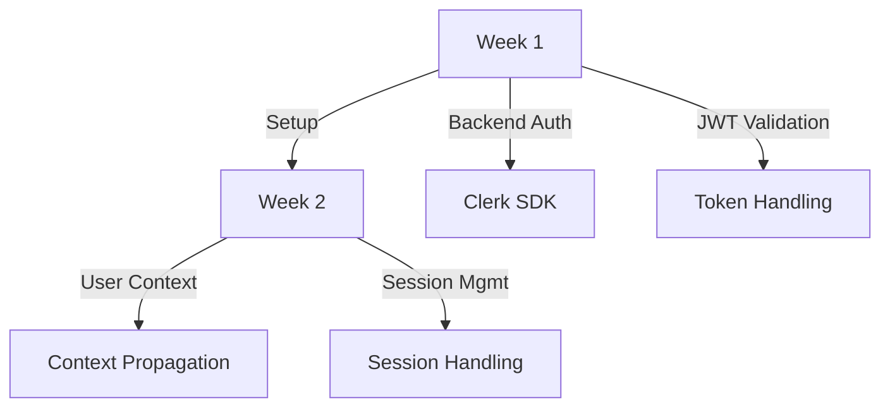
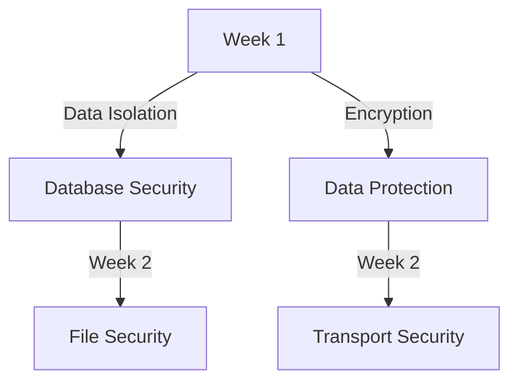
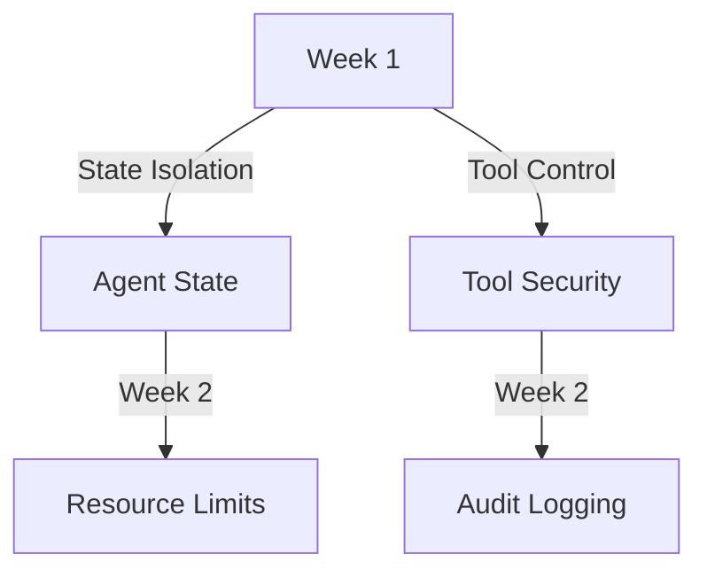
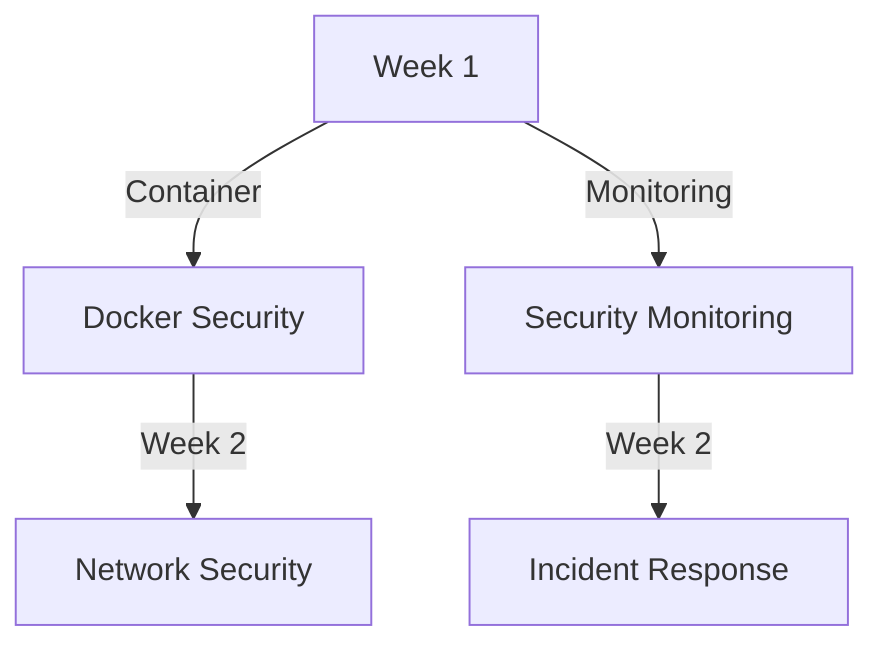

# MOSAIC Security Implementation Roadmap

## Overview

This roadmap outlines the practical implementation of MOSAIC's security architecture, focusing on core fundamentals first and building additional security layers iteratively. Each phase has clear objectives, success criteria, and testing requirements.

## Current State Assessment

### Existing Implementation
- Frontend Clerk authentication setup
- Basic database models with user_id support
- Initial WebSocket implementation
- Docker containerization
- Basic agent framework

### Security Gaps
- Backend authentication not implemented
- Missing user context in operations
- No data encryption
- Limited security testing
- Incomplete agent isolation

## Implementation Phases

### Phase 1: Core Authentication (2 Weeks)


#### Week 1: Backend Authentication
1. Clerk SDK Integration
   ```python
   # Example implementation
   from clerk_sdk_python import Clerk
   
   class AuthConfig:
       def __init__(self):
           self.clerk = Clerk(secret_key=os.getenv("CLERK_SECRET_KEY"))
   
       async def validate_token(self, token: str):
           return await self.clerk.verify_token(token)
   ```

2. JWT Validation Middleware
   ```python
   # Example implementation
   async def auth_middleware(request: Request):
       token = request.headers.get("Authorization")
       user = await auth_config.validate_token(token)
       request.state.user = user
   ```

#### Week 2: User Context
1. Context Propagation
2. Session Management
3. WebSocket Authentication

#### Success Criteria
- [ ] All API endpoints require authentication
- [ ] JWT validation working
- [ ] User context available in all requests
- [ ] WebSocket connections authenticated
- [ ] Session management implemented

#### Testing Requirements
- Unit tests for auth flows
- Integration tests for protected routes
- WebSocket authentication tests
- Session management tests

### Phase 2: Data Security (2 Weeks)


#### Week 1: Data Protection
1. Database Security
   ```python
   # Example implementation
   from cryptography.fernet import Fernet
   
   class DataProtection:
       def __init__(self):
           self.key = Fernet.generate_key()
           self.cipher = Fernet(self.key)
   
       def encrypt_data(self, data: bytes) -> bytes:
           return self.cipher.encrypt(data)
   ```

2. User Data Isolation
   ```python
   # Example implementation
   def get_user_data(user_id: str):
       return db.query(UserData).filter(UserData.user_id == user_id).all()
   ```

#### Week 2: File & Transport Security
1. Secure File Storage
2. TLS Configuration
3. API Security

#### Success Criteria
- [ ] Database encryption implemented
- [ ] User data properly isolated
- [ ] File storage secured
- [ ] TLS 1.3 enforced
- [ ] API endpoints secured

#### Testing Requirements
- Encryption/decryption tests
- Data isolation tests
- File security tests
- TLS configuration tests

### Phase 3: Agent Security (2 Weeks)


#### Week 1: Agent Isolation
1. User-Scoped State
   ```python
   # Example implementation
   class UserAgentState:
       def __init__(self, user_id: str):
           self.user_id = user_id
           self.state = {}
   
       def get_state(self):
           return self.state.get(self.user_id, {})
   ```

2. Tool Access Control
   ```python
   # Example implementation
   class ToolAccessControl:
       def validate_access(self, user_id: str, tool_name: str):
           return self.get_user_permissions(user_id).can_use_tool(tool_name)
   ```

#### Week 2: Resource Management
1. Resource Limits
2. Usage Monitoring
3. Audit Logging

#### Success Criteria
- [ ] Agent state isolated by user
- [ ] Tool access controlled
- [ ] Resource limits enforced
- [ ] Usage monitoring active
- [ ] Audit logging implemented

#### Testing Requirements
- State isolation tests
- Tool access tests
- Resource limit tests
- Audit log tests

### Phase 4: Security Hardening (2 Weeks)


#### Week 1: Infrastructure Security
1. Docker Security
   ```yaml
   # Example docker-compose.yml updates
   services:
     backend:
       user: "node"
       security_opt:
         - no-new-privileges:true
       read_only: true
       resources:
         limits:
           cpus: '1'
           memory: 1G
   ```

2. Network Isolation
3. Resource Limits

#### Week 2: Monitoring & Response
1. Security Monitoring
2. Incident Response
3. Audit Enhancements

#### Success Criteria
- [ ] Docker security configured
- [ ] Network isolation implemented
- [ ] Resource limits set
- [ ] Monitoring operational
- [ ] Incident response tested

#### Testing Requirements
- Container security tests
- Network isolation tests
- Resource limit tests
- Monitoring system tests

## Validation & Maintenance

### Security Testing
- Regular penetration testing
- Vulnerability scanning
- Security review process
- Compliance checking

### Ongoing Maintenance
- Security patch management
- Configuration reviews
- Access control updates
- Security training

## Success Metrics

### Core Metrics
1. Authentication Success
   - 100% API endpoint protection
   - Zero unauthorized access

2. Data Security
   - All sensitive data encrypted
   - No data leakage incidents

3. Agent Security
   - Complete user isolation
   - No resource limit breaches

4. System Security
   - Zero critical vulnerabilities
   - All security tests passing

### Monitoring Metrics
1. System Health
   - Error rate < 0.1%
   - 99.9% uptime

2. Security Events
   - All events logged
   - < 15min incident response

## Risk Mitigation

### Rollback Procedures
1. Authentication rollback
2. Data security rollback
3. Agent security rollback
4. System security rollback

### Contingency Plans
1. Authentication fallback
2. Data recovery procedures
3. Agent isolation recovery
4. System recovery

## Future Considerations

### Planned Enhancements
1. Advanced monitoring
2. AI-assisted security
3. Additional compliance
4. Enhanced encryption

### Long-term Goals
1. Zero-trust architecture
2. Advanced threat protection
3. Automated security response
4. Enhanced compliance support

## Conclusion

This roadmap provides a practical, phased approach to implementing MOSAIC's security architecture. By focusing on core fundamentals first and building additional security layers iteratively, we ensure a solid security foundation that can be enhanced over time.
