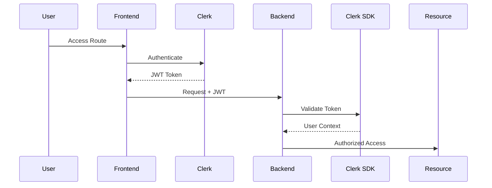
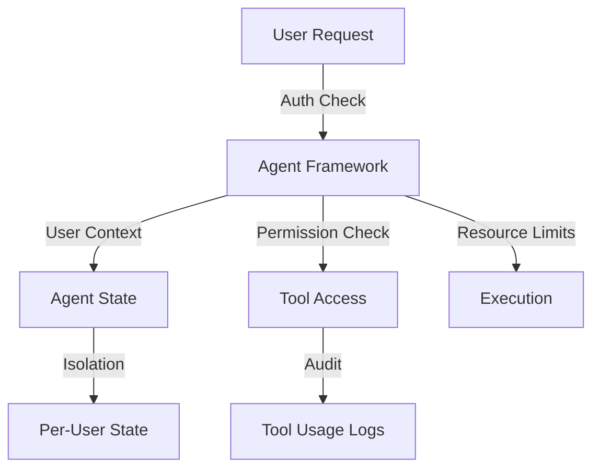
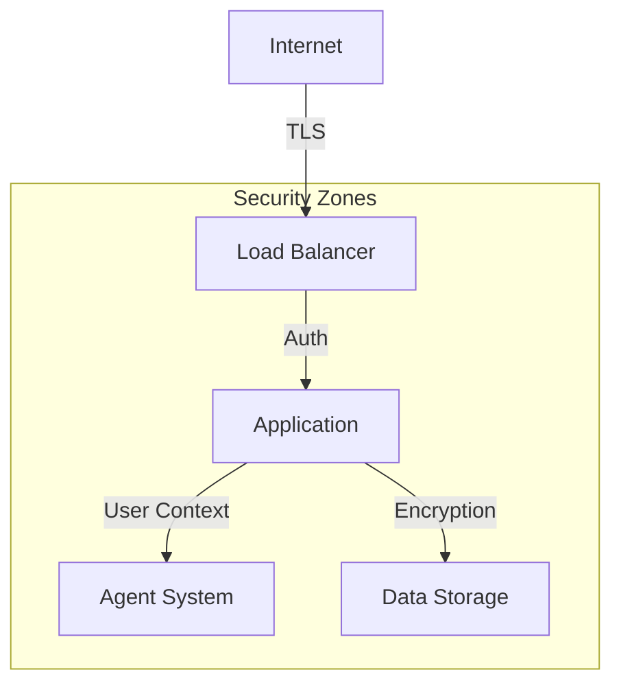

# MOSAIC Security Architecture

## Executive Summary

MOSAIC (Multi-agent Orchestration System for Adaptive Intelligent Collaboration) implements a practical, security-first architecture that prioritizes core security fundamentals while enabling powerful agent-based functionality. This document outlines our security approach based on three key principles:

1. **Simplicity Over Complexity**: Each security measure serves a clear purpose and addresses specific threats.
2. **Security by Design**: Security is fundamental to the system architecture, not an afterthought.
3. **Practical Implementation**: Focus on real threats with maintainable security measures.

## Core Security Model

### Authentication & Authorization

- **Clerk Integration**
  - Frontend route protection via middleware
  - Backend JWT validation using Clerk SDK
  - Secure session management
  - User context propagation

- **Authorization Framework**
  - Role-based access control (RBAC)
  - Resource-level permissions
  - User-scoped operations

### Data Security

- **Data Isolation**
  - User-level data segregation
  - Encrypted storage for sensitive data
  - Secure file handling
  - Input validation and sanitization

- **Transport Security**
  - TLS 1.3 for all connections
  - Secure WebSocket implementation
  - Protected API endpoints

### Agent Security Framework

- **Agent Isolation**
  - User-scoped agent state
  - Resource usage limits
  - Tool access control

- **Tool Security**
  - Permission-based access
  - Usage auditing
  - Input validation

## Security Boundaries

### Deployment Security

- **Container Security**
  - Non-root user execution
  - Resource limits
  - Volume security
  - Network isolation

- **Environment Security**
  - Secure configuration
  - Environment variable protection
  - Proper file permissions

### Data Protection

- **At Rest**
  - Database encryption
  - Secure file storage
  - Access logging

- **In Transit**
  - TLS encryption
  - Secure WebSocket protocol
  - API security

## Monitoring & Audit

### Security Monitoring
- Real-time error tracking
- Resource usage monitoring
- Security event logging
- Basic anomaly detection

### Audit System
- Operation logging
- Access tracking
- Tool usage audit
- Error logging

## Security Operations

### Incident Response
1. Detection via monitoring
2. Assessment of impact
3. Containment procedures
4. System recovery
5. Post-incident analysis

### Security Maintenance
- Regular security updates
- Dependency management
- Configuration reviews
- Access control updates

## Implementation Guidelines

### Security Standards
- OWASP Top 10 compliance
- Basic GDPR readiness
- Input validation
- Output encoding

### Development Practices
- Security code review
- Dependency scanning
- Regular testing
- Security documentation

## Future Security Evolution

### Planned Enhancements
- Enhanced monitoring
- Additional audit capabilities
- Advanced threat detection
- Security automation

### Security Roadmap
Refer to SECURITY_ROADMAP.md for detailed implementation phases and timelines.

## Conclusion

This security architecture provides a practical, implementable approach to protecting MOSAIC's users, data, and agent operations. By focusing on core security fundamentals and maintaining simplicity, we ensure effective security measures that can be properly maintained and enhanced over time.
